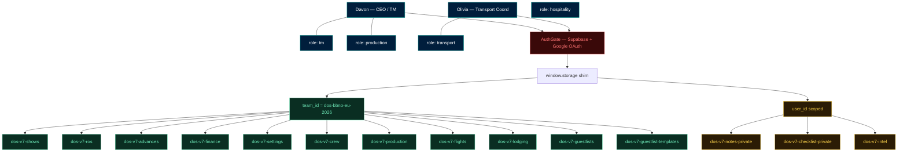
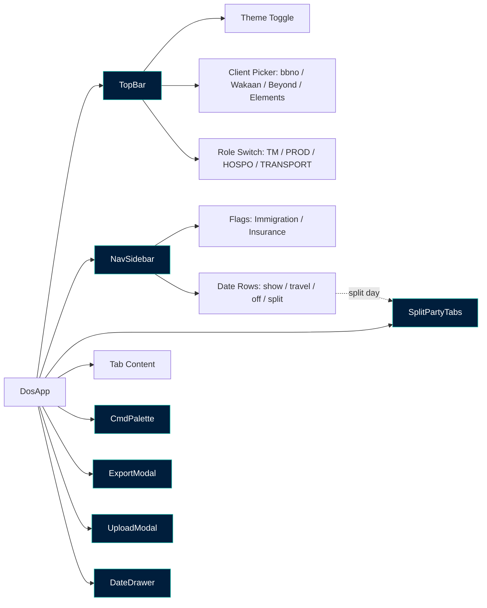
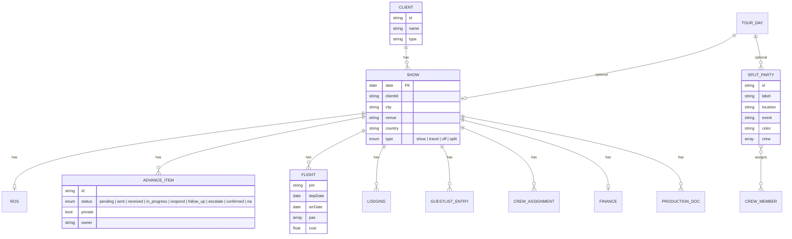

# DOS Tour Ops v7 — Structural Map



## App Shell



## Feature Tabs + Sub-Tabs

```mermaid
graph TB
  classDef tab fill:#002B4E,stroke:#4FA3E3,color:#fff
  classDef sub fill:#0A2A28,stroke:#14B8A6,color:#14B8A6
  classDef split fill:#2B1C05,stroke:#FCD34D,color:#FCD34D

  ROOT[8 Feature Tabs]:::tab

  ROOT --> T1[Production ▤]:::tab
  T1 --> T1a[Docs upload]:::sub
  T1 --> T1b[Parsed entities]:::sub
  T1 --> T1c[PDF viewer]:::sub

  ROOT --> T2[Schedule ▦ · ROS]:::tab
  T2 --> T2a[Anchors: doors / crew-call / curfew]:::sub
  T2 --> T2b[Block timeline]:::sub
  T2 --> T2c[Per-show overrides]:::sub

  ROOT --> T3[Advance ◎]:::tab
  T3 --> T3a[Standard checklist]:::sub
  T3 --> T3b[Custom items shared / private]:::sub
  T3 --> T3c[Status: pending→in-progress→confirmed + 9 states]:::sub
  T3 --> T3d[Contacts + notes]:::sub
  T3 --> T3e[Gmail intel panel]:::sub

  ROOT --> T4[Logistics ◈ · Transport]:::tab
  T4 --> T4a[EU Bus schedule — Pieter Smit]:::sub
  T4 --> T4b[Festival dispatch]:::sub
  T4 --> T4c[Flights list + scanner]:::sub

  ROOT --> T5[Crew ◇]:::tab
  T5 --> T5a[Artist side]:::sub
  T5 --> T5b[Venue side]:::sub

  ROOT --> T6[Finance ◐]:::tab
  T6 --> T6a[Settlement status]:::sub
  T6 --> T6b[Wire tracking]:::sub
  T6 --> T6c[Payout log]:::sub

  ROOT --> T7[Guest List ◉]:::tab
  T7 --> T7a[Templates]:::sub
  T7 --> T7b[Per-show lists]:::sub
  T7 --> T7c[Categories: aaa_crew / artist / vip]:::sub

  ROOT --> T8[Lodging ⌂]:::tab
  T8 --> T8a[Per-show rooms]:::sub
  T8 --> T8b[Email scanner]:::sub

  %% Split-day overlay
  SPLIT{{On split day}}:::split
  SPLIT -.applies to all tabs.-> ROOT
  SPLIT --> SPa[Party A — Worcester Show]:::split
  SPLIT --> SPb[Party B — EU Programming]:::split
```



## Entity Model



## API Handlers

```mermaid
graph LR
  classDef api fill:#3A0909,stroke:#F87171,color:#F87171
  classDef ext fill:#0A1F3D,stroke:#93C5FD,color:#93C5FD

  APP[DosApp] --> F[/api/flights]:::api
  APP --> I[/api/intel]:::api
  APP --> L[/api/lodging-scan]:::api
  APP --> PP[/api/parse-pdf]:::api
  APP --> PD[/api/parse-doc]:::api
  APP --> PR[/api/production]:::api

  F --> GM[Gmail API]:::ext
  I --> GM
  L --> GM

  F --> CL[Anthropic Claude + prompt cache]:::ext
  I --> CL
  L --> CL
  PP --> CL
  PD --> CL
  PR --> CL
```

## Role → Tab Access (defaults)

| Role       | Primary Tabs                              |
|------------|-------------------------------------------|
| TM         | Advance, Schedule, Finance, Guest List    |
| PROD       | Production, Schedule, Advance             |
| HOSPO      | Lodging, Guest List, Crew                 |
| TRANSPORT  | Logistics, Crew, Schedule                 |

## Day Types in Nav

| Type     | Color token        | Sub-tabs?          |
|----------|--------------------|--------------------|
| `show`   | success-bg/fg      | no                 |
| `travel` | info-bg / link     | no                 |
| `off`    | card-2 / text-mute | no                 |
| `split`  | warn-bg/fg         | **yes — per party**|
