# Flights Scan — Flow Chart
`api/flights.js`

```mermaid
flowchart TD

    subgraph ENTRY["ENTRY & AUTH"]
        A([POST /api/flights]) --> B[Supabase JWT auth]
        B -->|fail| ERR1([401 Unauthorized])
        B -->|pass| C["buildFlightQueryGroups\nafter = sweepFrom OR 90d ago"]
    end

    subgraph QUERY["GMAIL QUERY"]
        C --> H1

        H1["HIGH — 20 queries — parallel — maxResults 25
        ─────────────────────────────────────────────
        category:travel
        subject: Flight Receipt / Confirmation / e-ticket
        subject: Boarding Pass / Itinerary / Trip Confirmation
        booking reference + flight
        confirmation code + flight
        Destination sweeps: BOS DEN YYZ YOW
        LHR DUB ZRH CDG PRG BER + confirmation"]

        H1 --> CAP1{seen.size < 80?}

        CAP1 -->|yes| L1["LOW — 5 queries — parallel — maxResults 500
        ──────────────────────────────────────────────
        Carrier name OR-list + confirmation/receipt
        IATA code patterns: Flight DL UA AA B6 LH AF KL…
        OTA bookings: Expedia Booking.com Concur Hopper
        Ground/rail: Uber Eurostar Trainline FlixBus
        Private charters"]

        CAP1 -->|no| CAP2
        L1 --> CAP2[Cap at 100 IDs]
    end

    subgraph FETCH["THREAD FETCH & FILTER"]
        CAP2 --> F1["fetchBatched — batch=20
        extractHeaders — 8000-char body
        Forwarded sender detection
        PDF attachment collection"]

        F1 --> MKT{isMarketingSubject?}
        MKT -->|"check-in open / upgrade seat
        earned miles / survey / delay"| MSKIP([skip thread])
        MKT -->|pass| FRESH["Mark freshIds — lastMsgMs < 48h"]
    end

    subgraph CACHE["CACHE CHECK"]
        FRESH --> CC{Per-thread cache hit?
        hashBody + lastMsgMs
        + attachmentFingerprints}
        CC -->|hit| CHIT[cachedFlights]
        CC -->|miss| FTHREADS[freshThreads]
    end

    subgraph JSONLD["JSON-LD FAST PATH"]
        FTHREADS --> JL["extractJsonLdReservations from htmlRaw
        jsonLdToFlight — map to flight shape
        Major carriers: UA AA DL LH BA AF KLM"]

        JL --> JLCHECK{mapped.length
        >= expectedLegCount?}

        JLCHECK -->|"complete
        zero Claude tokens"| JLDONE["jsonLdTids
        source = jsonld"]

        JLCHECK -->|partial| JLFALL["fall through to Claude
        log: jsonld_partial"]
    end

    subgraph PARTITION["PARTITION CLAUDE THREADS"]
        JLFALL --> CLAUDE[claudeThreads = fresh minus jsonLdTids]
        CLAUDE --> PDF{SCAN_PDFS = 1?}
        PDF -->|yes| WPDF["withPdfThreads
        one-at-a-time
        max 2 PDFs per thread — 5MB cap
        Folio dedup — trust PDF over body"]
        PDF -->|no| TONLY[textOnlyThreads]
        WPDF --> TONLY

        TONLY --> MLCHECK{expectedLegCount >= 2?}
        MLCHECK -->|yes| MLTHREADS[multiLegTextThreads]
        MLCHECK -->|no| SIMPLE[simpleTextThreads]
    end

    subgraph PARSE["CLAUDE PARSE + VERIFY"]
        SIMPLE --> BATCH["Batch = 6
        parseAndVerifyBatch — parallel across batches"]
        BATCH --> SON1["Sonnet 4.6 — parse
        Extract: flightNo carrier from to
        depDate dep arrDate arr
        pax pnr confirmNo ticketNo
        cost currency tid"]
        SON1 --> HAI1["Haiku 4.5 — verify
        Check: IATA codes passenger names
        dates multi-leg codes pnr vs ticketNo
        Apply corrections"]
        HAI1 --> SFLIGHT["source = claude"]

        MLTHREADS --> MLISOLATED["parseAndVerifyMultiLeg — isolated
        Explicit leg-count hint in prompt"]
        MLISOLATED --> SON2["Sonnet 4.6 — parse
        IMPORTANT: N+ legs expected
        Outbound + Return + Connections"]
        SON2 --> HAI2["Haiku 4.5 — verify"]
        HAI2 --> MLFLIGHT["source = claude_multileg"]

        WPDF --> SON3["Sonnet 4.6 — parse with PDF
        Document blocks included
        Trust PDF over body for cost
        dates confirmNo ticketNo"]
        SON3 --> HAI3["Haiku 4.5 — verify"]
        HAI3 --> PDFFLIGHT["source = claude_pdf"]
    end

    subgraph RETRY["MISSED-LEG RETRY"]
        SFLIGHT --> RCHECK{"simpleTextThreads only
        byTidCount < expectedLegCount?"}
        RCHECK -->|yes| RHINT["Re-parse with hinted prompt
        IMPORTANT: you missed N legs
        Dedup new legs against existing"]
        RHINT --> RFLIGHT["source = claude_retry"]
        RCHECK -->|no| MERGE
        RFLIGHT --> MERGE
    end

    subgraph OUTPUT["DEDUP, MATCH & OUTPUT"]
        JLDONE --> MERGE
        MLFLIGHT --> MERGE
        PDFFLIGHT --> MERGE
        CHIT --> MERGE

        MERGE --> DEDUP["dedupFlights
        key: flightNo + depDate + from + to
        JSON-LD wins on conflict
        pax union merge
        merge pnr confirmNo ticketNo"]

        DEDUP --> MATCH["matchFlightToShow
        Inbound: arrives 0–3d before show
        Outbound: departs 0–2d after show
        Airport → city map lookup"]

        MATCH --> VALID{isValidFlight?
        needs PNR OR
        flightNo+depDate+from+to}

        VALID -->|fail| DROP([drop — hallucination shell])
        VALID -->|pass| PUTCACHE[putCachedThread per thread]

        PUTCACHE --> DONE(["flights[]
        threadsFound / Parsed / Cached
        marketingSkipped
        inputTokens / outputTokens
        scanRunId"])
    end
```

---

## Parse Path Summary

| Path | Model | Trigger | Token cost |
|------|-------|---------|------------|
| JSON-LD fast path | none | schema.org in HTML | free |
| Cache hit | none | body hash unchanged | free |
| Simple batch | Sonnet + Haiku | text-only, 1 leg | medium |
| Multi-leg isolated | Sonnet + Haiku | expectedLegCount ≥ 2 | medium |
| PDF thread | Sonnet + Haiku | attachment present | high |
| Missed-leg retry | Sonnet only | batch undercounted | medium |

## Key Thresholds

| Parameter | Value |
|-----------|-------|
| Thread cap | 100 IDs |
| Sweep window | 90d (default) |
| Fetch batch size | 20 |
| Body cap | 8,000 chars |
| Claude batch size | 6 threads |
| Cache TTL | body hash + lastMsgMs |
| Inbound window | 0–3 days before show |
| Outbound window | 0–2 days after show |
| PDF max per thread | 2 files / 5 MB each |
| Low sweep threshold | seen.size < 80 |
