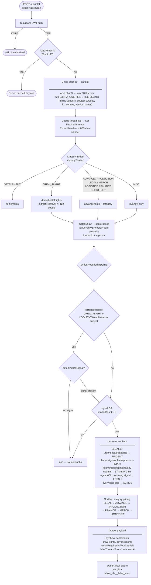

# DOS Scan Pipeline — Query Trees & Flow Charts

---

## 1. Intel / Label Scan (`api/intel.js`)



---

## 2. Flights Scan (`api/flights.js`)

```mermaid
flowchart TD
    A([POST /api/flights]) --> B[Supabase JWT auth]
    B -->|invalid| ERR1([401])
    B -->|valid| C[buildFlightQueryGroups\nafter = sweepFrom or 90d ago]

    C --> D

    D["HIGH — 20 queries — maxResults=25 each — parallel
    ──────────────────────────────────────────────────────
    category:travel
    subject: Flight Receipt / Confirmation / e-ticket
    subject: Boarding Pass / Itinerary / Trip Confirmation
    booking reference / confirmation code + flight
    Destination sweeps: BOS/DEN/YYZ/YOW/LHR/DUB/ZRH
    CDG/PRG/BER + confirmation/receipt/itinerary"]

    D --> E{seen.size < 80?}
    E -->|yes| F["LOW — 5 queries — maxResults=500 each
    ──────────────────────────────────────────
    Full carrier name OR list + confirmation/receipt
    IATA code patterns: Flight DL/UA/AA/B6/LH/AF…
    OTA bookings: Expedia/Booking.com/Concur/Hopper
    Ground/rail: Uber/Eurostar/Trainline/FlixBus
    Private charters"]
    E -->|no| G
    F --> G

    G[Cap at 100 IDs\nfetchBatched batch=20\nextractHeaders\n8000-char body\nForwarded sender detection\nPDF attachment collection]

    G --> H{isMarketingSubject?\ncheck-in open / upgrade seat\nearned miles / survey\nflight delay / loyalty}
    H -->|yes| MSKIP([skip thread])
    H -->|no| I

    I[Mark freshIds\nlastMsgMs < 48h]
    I --> J{Cache check per thread\nhashBody + lastMsgMs\n+ attachmentFingerprints}
    J -->|hit| CACHED[cachedFlights]
    J -->|miss| K[freshThreads]

    K --> L["JSON-LD fast path
    ─────────────────────────────────
    extractJsonLdReservations from htmlRaw
    jsonLdToFlight → mapped legs
    expectedLegCount heuristic:
    count distinct flight#s + route arrows"]

    L --> M{mapped.length\n>= expectedLegCount?}
    M -->|complete| N[jsonLdTids\nzero Claude tokens\nsource=jsonld]
    M -->|partial| O[fall through to Claude]

    O --> P[claudeThreads = fresh - jsonLdTids]
    P --> Q{SCAN_PDFS=1?}
    Q -->|yes| R[withPdfThreads\none-at-a-time\nPDF max 2/thread 5MB\ntrust PDF over body]
    Q -->|no| S
    R --> S

    S[textOnlyThreads]
    S --> T{expectedLegCount >= 2?}
    T -->|yes| U["multiLegTextThreads
    parseAndVerifyMultiLeg — isolated
    Explicit leg count hint in prompt
    Sonnet parse → Haiku verify
    source=claude_multileg"]
    T -->|no| V

    V["simpleTextThreads
    Batch=6 → parseAndVerifyBatch
    Sonnet parse → Haiku verify
    Parallel across batches
    source=claude"]

    V --> W{"Missed-leg retry
    (simpleTextThreads only)
    byTidCount < expectedLegCount?"}
    W -->|yes| X["Re-parse with hint prompt
    IMPORTANT: you missed N legs
    Dedup new legs against existing
    source=claude_retry"]
    W -->|no| Y

    X --> Y

    U --> Y
    N --> Y
    CACHED --> Y
    R --> Y

    Y[dedupFlights\nflightNo + depDate + from + to\nJSON-LD wins on conflict\npax union merge]

    Y --> Z[matchFlightToShow\nInbound: arrives 0-3d before show\nOutbound: departs 0-2d after show\nAirport → city map lookup]

    Z --> AA{isValidFlight?\nneeds PNR OR\nflightNo+depDate+from+to}
    AA -->|invalid| DROP([drop — hallucination shell])
    AA -->|valid| BB[putCachedThread per thread]

    BB --> OUT([flights[]\nthreadsFound / Parsed / Cached\nmarketingSkipped\ninputTokens / outputTokens\nscanRunId])
```

---

## 3. Lodging Scan (`api/lodging-scan.js`)

```mermaid
flowchart TD
    A([POST /api/lodging-scan]) --> B[Supabase JWT auth]
    B -->|invalid| ERR1([401])
    B -->|valid| C[buildLodgingQueryGroups\nafter = sweepFrom or 14d ago]

    C --> D

    D["HIGH — 14 queries — maxResults=25 — parallel
    ──────────────────────────────────────────────────
    subject: hotel confirmation
    subject: reservation confirmation + hotel/inn/suite
    subject: booking confirmation + hotel/airbnb/vrbo
    subject: check-in + hotel / subject: your stay
    subject: room reservation
    confirmation number + hotel/inn/check-in
    reservation number + hotel/inn
    check-in + check-out + hotel + confirmation
    Touring-specific:
    room block / room list / group reservation
    tour accommodation / band hotel / crew hotel
    promoter accommodation / artist accommodation"]

    D --> E{seen.size < 40?}
    E -->|yes| F["LOW — 2 queries — maxResults=500
    ─────────────────────────────────────────
    Brand sweep: Marriott/Bonvoy/Sheraton/Westin/
    W Hotels/Ritz-Carlton/Four Seasons/Hilton/
    Hampton Inn/DoubleTree/Aloft/Hyatt/Andaz/
    IHG/InterContinental/Holiday Inn/Crowne Plaza/
    Kimpton/Accor/Novotel/Sofitel/citizenM/
    Premier Inn/Travelodge/NH Hotels + confirmation
    OTA sweep: Booking.com/Expedia/Hotels.com/
    Airbnb/VRBO/Agoda/Hopper/Concur + hotel"]
    E -->|no| G
    F --> G

    G[Cap at 50 IDs\nfetchBatched batch=25\nextractHeaders\n1400-char body\nAttachment dedup\nMariott folio dedup]

    G --> H{Cache check per thread\nhashBody + lastMsgMs\n+ attachmentFingerprints}
    H -->|hit| CACHED[cacheHits]
    H -->|miss| I[fresh threads]

    I --> J{PDF attachments\nattached?}
    J -->|yes| K["One-at-a-time with document blocks
    max 2 PDFs per thread / 5MB each
    Folio dedup: skip Receipt copies
    Trust PDF over body text for:
    cost, dates, confirmNo, room type"]
    J -->|no| L[Text-only parse]

    K --> M[Claude Sonnet\nlodging extraction prompt\nExtract: name, address, city\ncheckIn/Out, confirmNo\nbookingRef, cost, currency\npax, stars, notes, tid]
    L --> M

    M --> N[putCachedThread per thread]
    CACHED --> O

    N --> O([lodgings[]\nthreadsFound / Parsed / Cached\ninputTokens / outputTokens\nscanRunId])
```

---

## Shared Infrastructure (`api/lib/`)

| Module | Role |
|--------|------|
| `gmail.js` | `gmailSearch`, `fetchBatched`, `extractBody`, `stripMarketingFooter`, `extractHtmlRaw`, `extractJsonLdReservations`, `extractJson` |
| `anthropic.js` | `ANTHROPIC_URL`, `ANTHROPIC_HEADERS`, `DEFAULT_MODEL` (Sonnet 4.6) |
| `scanMemory.js` | `hashBody`, `shouldUseCached`, `startScanRun`, `finishScanRun`, `getCachedThread`, `putCachedThread`, `logEnhancement`, `bumpStopReason` |
| `attachments.js` | `collectThreadAttachments`, `dedupFolios`, `fetchAttachmentB64`, `attachmentFingerprint` |

### Token usage by parse path

| Path | Model | Threads | Relative cost |
|------|-------|---------|---------------|
| JSON-LD fast path | none | fresh threads from major carriers | free |
| Cache hit | none | unchanged threads | free |
| Simple batch | Sonnet parse + Haiku verify | up to 6/call | medium |
| Multi-leg isolated | Sonnet parse + Haiku verify | 1/call | medium |
| Missed-leg retry | Sonnet only | 1/call | medium |
| PDF threads | Sonnet parse + Haiku verify | 1/call + doc blocks | high |
| Intel label scan | none — regex only | all threads | free |
